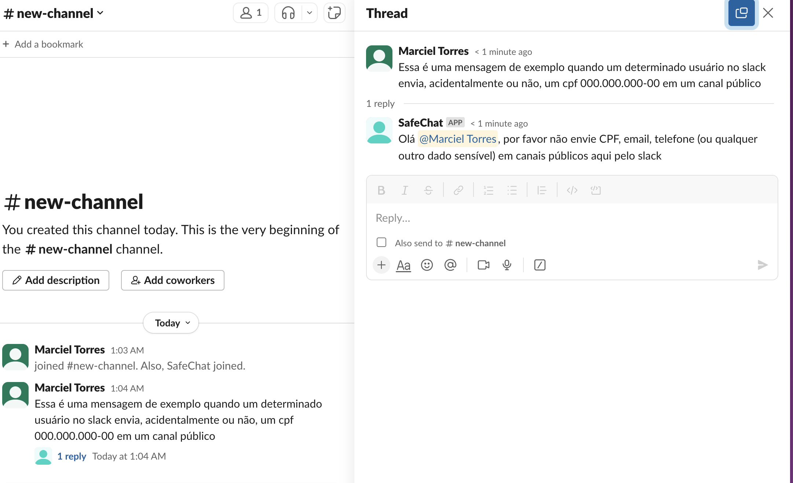
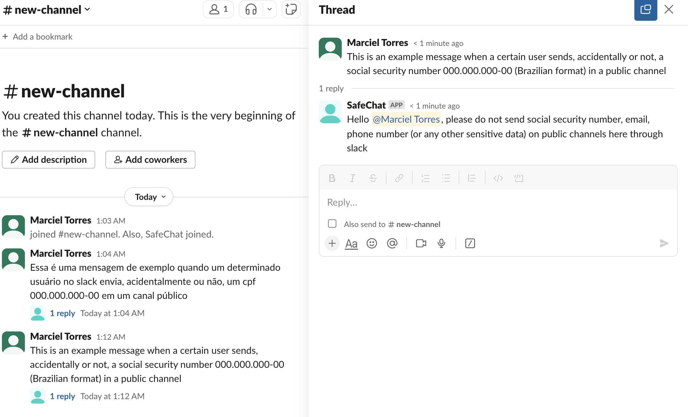

# SafeChat Slack Bot [](https://codecov.io/gh/marcieltorres/safe-chat-slack-bot)

> [English](README.md) version.

O SafeChat Slack Bot é um projeto open source desenvolvido para aumentar a segurança dos dados dentro dos espaços de trabalho do Slack. O principal objetivo do bot é fornecer alertas em tempo real aos usuários quando informações sensíveis, como CPF, endereços de e-mail e outros dados pessoais, são compartilhados nos canais do Slack. O Bot identifica e notifica os usuários sobre possíveis violações de dados, promovendo um ambiente de comunicação mais seguro no Slack.

## Como SafeChat funciona

*O SafeChat deve fazer parte do canal para poder mandar mensagens.*

### Versão do bot interagindo em Português


### Versão do bot interagindo em Inglês


## Installando o bot no workspace

### Criando um Slack App usando o arquivo manifest.json

1. Abra o link https://api.slack.com/apps/new e escolha `From an app manifest`
2. Selecione o workspace que você deseja instalar a aplicação
3. Copie o conteúdo do arqwuivo `manifest.json` no campo que diz `Paste your manifest code here* (within the JSON tab)` e clique em Próximo
4. Revise as configurações e clique em `Create`
5. Clique em `Install to Workspace` e siga as instruções das próximas telas. Você será direcionado para a página `App Configuration dashboard`.

### Gerando os tokens: SLACK_BOT_TOKEN e SLACK_APP_TOKEN

1. Vá até as página de configuração do app e clique em `OAuth & Permissions` no menu esquerdo, então copie o `Bot User OAuth Token`. Esse token deverá ser armazenado como valor da variável de ambiente `SLACK_BOT_TOKEN`.
2. Clique em `Basic Information` no menu lateral e siga os passos na seção `App-Level Tokens` para criar o `app-level token` com o `scope` `connections:write`. Esse token deverá ser armazenado como valor da variável de ambiente `SLACK_APP_TOKEN`.

## Tecnologia e recursos utilizados

- [Python 3.11](https://www.python.org/downloads/release/python-3110/) - **pré-requisito**
- [Docker](https://www.docker.com/get-started) - **pré-requisito**
- [Docker Compose](https://docs.docker.com/compose/) - **pré-requisito**
- [gettext - Serviço de internacionalização](https://docs.python.org/pt-br/3/library/gettext.html) - **pré-requisito**
- [Poetry](https://python-poetry.org/) - **pré-requisito**
- [Ruff](https://github.com/astral-sh/ruff)
- [Slack Bolt](https://pypi.org/project/slack-bolt/)
- [i18n](https://docs.python.org/3/library/i18n.html)

*Por favor, preste atenção nos **pré-requisitos** que você deverá instalar/configurar.*

## Como instalar, rodar e testar a aplicação

### Variáveis de ambiente

Variable | Description | Available Values | Default Value | Required
--- | --- | --- | --- | ---
ENV | O ambiente da aplicacão | `dev / test / qa / prod` | `dev` | Sim
PYTHONPATH | Guia para o python interpretar os pacotes da aplicação e dependências | [ref](https://docs.python.org/3/using/cmdline.html#envvar-PYTHONPATH) | `.` | Sim
LANGUAGE | O idioma que o Bot irá interagir | `en / pt_BR` | `pt_BR` | Sim
SLACK_BOT_TOKEN | O `bot token` gerado após a instalação do app | `um token válido` | `-` | Sim
SLACK_APP_TOKEN | O `app token` gerado após a instalação do app | `um token válido` | `-` | Sim

*Nota: Quando você rodar o comando install (usando docker ou localmente), um arquivo .env será criado automaticamente baseado no arquivo [env.template](env.template)*

Command | Docker | Locally | Description
---- | ------- | ------- | -------
install | `make docker/install` | `make local/install` | Para instalar o projeto
tests | `make docker/tests` | `make local/tests` | Para rodar os testes da aplicação (com coverage)
lint | `make docker/lint` | `make local/lint` | Para rodar análises estáticas do código usando `ruff`
lint/fix | `make docker/lint/fix` | `make local/lint/fix` | Para corrigir os arquivos após a análise estática
run | `make docker/run` | `make local/run` | Para rodar a aplicação

*Confira todos os comandos disponíveis no arquivo [Makefile](Makefile)*.

## Múltiplos Idioma

O Bot consegue interagir com outros idiomas além do Português utilizando o padrão [i18n](https://docs.python.org/3/library/i18n.html).

Estrutura de arquivos e pastas:
```
├─ src
│  ├─ locales
│  │  └─ en
│  │      └─ LC_MESSAGES
│  │          └─ base.po
│  │  └─ pt_BR
│  │      └─ LC_MESSAGES
│  │          └─ base.po
```

### Como adicionar um novo idioma

1) Crie um novo diretório em `src/locales` com o novo idioma;
2) Cria um novo arquivo chamado `base.po` nesse novo diretóprio (você pode copiar a estrutura de outro idioma já suportado);
3) Faça a tradução de todas as mensagens;
4) Crie os arquivos `mo` usando o comando `make generate-mo-files`;
5) Inclua o comando para gerar o arquivo .po no Dockerfile.

## Logging

Esse projeto usa uma maneira muito simples para configurar os logs com o arquivo [logging.conf](logging.conf).

## Settings

É possível gerenciar as configurações estáticas do projeto com o arquivo [settings.conf](settings.conf) através da [classe de configuração](./src/config/settings.py) com recursos do [ConfigParser](https://docs.python.org/3/library/configparser.html).
