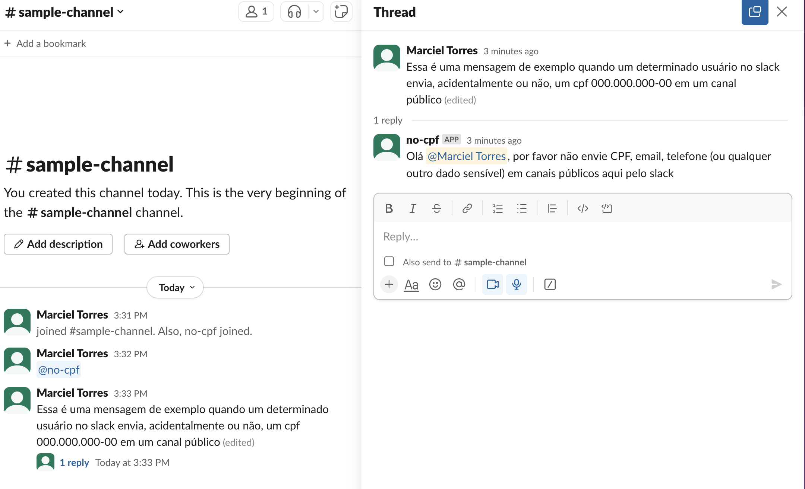

# SafeChat Slack Bot [](https://codecov.io/gh/marcieltorres/safe-chat-slack-bot)

The SafeChat is a simple slack bot that analyzes messages sent on channels and warns about possible sensitive data from someone, such as a social security number, for example.

## How bot works on slack workspace



## Technology and Resources

- [Python 3.11](https://www.python.org/downloads/release/python-3110/) - **pre-requisite**
- [Docker](https://www.docker.com/get-started) - **pre-requisite**
- [Docker Compose](https://docs.docker.com/compose/) - **pre-requisite**
- [Poetry](https://python-poetry.org/) - **pre-requisite**
- [Ruff](https://github.com/astral-sh/ruff)
- [Slack Bolt](https://pypi.org/project/slack-bolt/)
- [i18n](https://docs.python.org/3/library/i18n.html)


*Please pay attention on **pre-requisites** resources that you must install/configure.*

## How to create and configure a new Slack Bot

You can find the official docs [here](https://api.slack.com/start/building/bolt-python).

This bot needs to have the following User Token Scopes added:
```
app_mentions:read
channels:history
channels:read
chat:write
im:history
im:read
```

Follow this [guide](https://api.slack.com/tutorials/tracks/getting-a-token) to generate the tokens.

## How to install, run and test

### Environment variables

Variable | Description | Available Values | Default Value | Required
--- | --- | --- | --- | ---
ENV | The application enviroment | `dev / test / qa / prod` | `dev` | Yes
PYTHONPATH | Provides guidance to the Python interpreter about where to find libraries and applications | [ref](https://docs.python.org/3/using/cmdline.html#envvar-PYTHONPATH) | `.` | Yes
LANGUAGE | The bot language | `en / pt_BR` | `pt_BR` | Yes
SLACK_BOT_TOKEN | The slack bot token | `a valid token` | `-` | Yes
SLACK_APP_TOKEN | The slack app token | `a valid token` | `-` | Yes

*Note: When you run the install command (using docker or locally), a .env file will be created automatically based on [env.template](env.template)*

Command | Docker | Locally | Description
---- | ------- | ------- | -------
install | `make docker/install` | `make local/install` | to install
tests | `make docker/tests` | `make local/tests` | to run the tests with coverage
lint | `make docker/lint` | `make local/lint` | to run static code analysis using ruff
lint/fix | `make docker/lint/fix` | `make local/lint/fix` | to fix files using ruff
run | `make docker/run` | `make local/run` | to run the project
build image | `make docker/image/build` | - | to build the docker image
push image | `make docker/image/push` | - | to push the docker image

**Helpful commands**

*Please, check all available commands in the [Makefile](Makefile) for more information*.

## Multi Language

The Bot supports multiple languages using [i18n](https://docs.python.org/3/library/i18n.html) pattern.

Locale file structure:
```
├─ src
│  ├─ locales
│  │  └─ en
│  │      └─ LC_MESSAGES
│  │          └─ base.po
│  │  └─ pt_BR
│  │      └─ LC_MESSAGES
│  │          └─ base.po
```

### How to add a new language

1) Create a new folder in `src/locales` with the new language;
2) Create a new `base.po` file inside this folder (you just can copy from another language);
3) Translate all the messages;
4) Generate the `mo` files using the command `make generate-mo-files`

## Logging

This project uses a simple way to configure the log with [logging.conf](logging.conf) to show the logs on the container output console.

## Settings

This project uses a simple way to manage the settings with [settings.conf](settings.conf) and [ConfigParser](https://docs.python.org/3/library/configparser.html) using a [config class](./src/config/settings.py).
