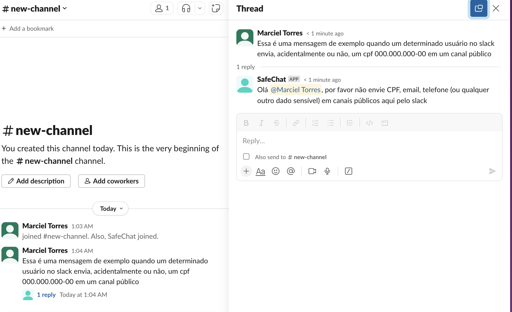

# SafeChat Slack Bot [](https://codecov.io/gh/marcieltorres/safe-chat-slack-bot)

> Readme em [Português - PTBR](README.PTBR.md).

SafeChat Slack Bot is an open-source project designed to enhance data security within Slack workspaces. The bot's primary objective is to provide real-time alerts to users when sensitive information such as CPF (Brazilian taxpayer registry identification), email addresses, and other personally identifiable information (PII) are shared within Slack channels. SafeChat Slack Bot identifies and notifies users about potential data breaches, promoting a safer and more secure communication environment within Slack.

## How SafeChat works

*The SafeChat must be a member to receive messages from a channel or dm.*

### Portuguese version (pt-br)


### English version


## Installing on workspace

### Create a Slack App using manifest.json file

1. Open https://api.slack.com/apps/new and choose "From an app manifest"
2. Choose the workspace you want to install the application to
3. Copy the contents of manifest.json into the text box that says *Paste your manifest code here* (within the JSON tab) and click Next
4. Review the configuration and click Create
5. Click Install to Workspace and Allow on the screen that follows. You'll then be redirected to the App Configuration dashboard.

### SLACK_BOT_TOKEN and SLACK_APP_TOKEN variables

Before you can run the app, you'll need to store some environment variables.

1. Open your apps configuration page from this list, click OAuth & Permissions in the left hand menu, then copy the Bot User OAuth Token. You will store this in your environment as SLACK_BOT_TOKEN.
2. Click *Basic Information from the left hand menu and follow the steps in the App-Level Tokens section to create an app-level token with the connections:write scope. Copy this token. You will store this in your environment as SLACK_APP_TOKEN.

## Technology and Resources

- [Python 3.11](https://www.python.org/downloads/release/python-3110/) - **pre-requisite**
- [Docker](https://www.docker.com/get-started) - **pre-requisite**
- [Docker Compose](https://docs.docker.com/compose/) - **pre-requisite**
- [gettext - Multilingual internationalization services](https://docs.python.org/pt-br/3/library/gettext.html) - **pre-requisite**
- [Poetry](https://python-poetry.org/) - **pre-requisite**
- [Ruff](https://github.com/astral-sh/ruff)
- [Slack Bolt](https://pypi.org/project/slack-bolt/)
- [i18n](https://docs.python.org/3/library/i18n.html)

*Please pay attention on **pre-requisites** resources that you must install/configure.*

## How to install, run and test

### Environment variables

Variable | Description | Available Values | Default Value | Required
--- | --- | --- | --- | ---
ENV | The application enviroment | `dev / test / qa / prod` | `dev` | Yes
PYTHONPATH | Provides guidance to the Python interpreter about where to find libraries and applications | [ref](https://docs.python.org/3/using/cmdline.html#envvar-PYTHONPATH) | `.` | Yes
LANGUAGE | The bot language | `en / pt_BR` | `pt_BR` | Yes
SLACK_BOT_TOKEN | The slack bot token | `a valid token` | `-` | Yes
SLACK_APP_TOKEN | The slack app token | `a valid token` | `-` | Yes

*Note: When you run the install command (using docker or locally), a .env file will be created automatically based on [env.template](env.template)*

Command | Docker | Locally | Description
---- | ------- | ------- | -------
install | `make docker/install` | `make local/install` | to install
tests | `make docker/tests` | `make local/tests` | to run the tests with coverage
lint | `make docker/lint` | `make local/lint` | to run static code analysis using ruff
lint/fix | `make docker/lint/fix` | `make local/lint/fix` | to fix files using ruff
run | `make docker/run` | `make local/run` | to run the project
build image | `make docker/image/build` | - | to build the docker image
push image | `make docker/image/push` | - | to push the docker image

**Helpful commands**

*Please, check all available commands in the [Makefile](Makefile) for more information*.

## Multi Language

The Bot supports multiple languages using [i18n](https://docs.python.org/3/library/i18n.html) pattern.

Locale file structure:
```
├─ src
│  ├─ locales
│  │  └─ en
│  │      └─ LC_MESSAGES
│  │          └─ base.po
│  │  └─ pt_BR
│  │      └─ LC_MESSAGES
│  │          └─ base.po
```

### How to add a new language

1) Create a new folder in `src/locales` with the new language;
2) Create a new `base.po` file inside this folder (you just can copy from another language);
3) Translate all the messages;
4) Generate the `mo` files using the command `make generate-mo-files`;
5) Include the command to generate po file on Dockerfile.

## Logging

This project uses a simple way to configure the log with [logging.conf](logging.conf) to show the logs on the container output console.

## Settings

This project uses a simple way to manage the settings with [settings.conf](settings.conf) and [ConfigParser](https://docs.python.org/3/library/configparser.html) using a [config class](./src/config/settings.py).
